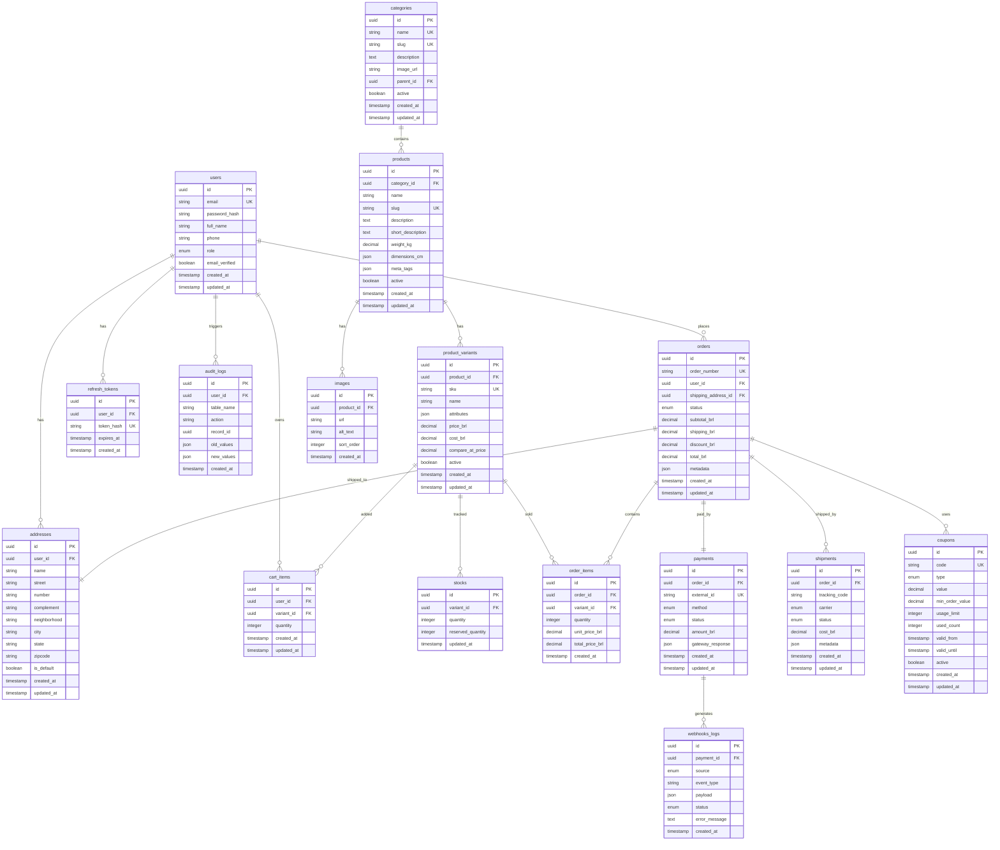

# 🛍️ Imports E-commerce# 🛍️ Imports E-commerce


> **Modern e-commerce platform for imported perfumes built with Next.js 14, TypeScript, and Tailwind CSS**> **Modern e-commerce platform for imported perfumes built with Next.js 14, TypeScript, and Tailwind CSS**


[](https://nextjs.org/)[](https://nextjs.org/)

[](https://www.typescriptlang.org/)[](https://www.typescriptlang.org/)

[](https://tailwindcss.com/)[](https://tailwindcss.com/)

[](https://reactjs.org/)[](https://reactjs.org/)


------


## 🌟 **Overview**## 🌟 **Overview**


A professional full-stack e-commerce solution designed specifically for luxury imported perfume retail. Built with modern technologies and featuring a minimalist black & white design inspired by premium brands like Nike and Adidas.A professional full-stack e-commerce solution designed specifically for luxury imported perfume retail. Built with modern technologies and featuring a minimalist black & white design inspired by premium brands like Nike and Adidas.


### 🎯 **Project Purpose**### 🎯 **Project Purpose**

This platform serves the Brazilian luxury perfume market, specializing in:This platform serves the Brazilian luxury perfume market, specializing in:

- **Arabian Fragrances** (Árabes)- **Arabian Fragrances** (Árabes)

- **French Perfumes** (Franceses) - **French Perfumes** (Franceses) 

- **Masculine Collections** (Masculinos)- **Masculine Collections** (Masculinos)

- **Feminine Collections** (Femininos)- **Feminine Collections** (Femininos)

- **Unisex Options** (Unissex)- **Unisex Options** (Unissex)


------


## ✨ **Features**## ✨ **Features**


### 🛒 **E-commerce Core**### 🛒 **E-commerce Core**

- **Product Catalog** with advanced filtering and search- **Product Catalog** with advanced filtering and search

- **Shopping Cart** with persistent state management- **Shopping Cart** with persistent state management

- **Secure Checkout** with multiple payment methods- **Secure Checkout** with multiple payment methods

- **User Authentication** and profile management- **User Authentication** and profile management

- **Order Tracking** and history- **Order Tracking** and history


### 🎨 **Design & UX**### 🎨 **Design & UX**

- **Responsive Design** optimized for all devices- **Responsive Design** optimized for all devices

- **Minimalist UI** inspired by premium brands- **Minimalist UI** inspired by premium brands

- **Dark Theme** with black & white color scheme- **Dark Theme** with black & white color scheme

- **Smooth Animations** and micro-interactions- **Smooth Animations** and micro-interactions

- **Accessibility** compliant components- **Accessibility** compliant components


### 🔧 **Technical Features**### 🔧 **Technical Features**

- **Server-Side Rendering** (SSR) with Next.js 14- **Server-Side Rendering** (SSR) with Next.js 14

- **App Router** for modern routing architecture- **App Router** for modern routing architecture

- **TypeScript** for type safety and better DX- **TypeScript** for type safety and better DX

- **State Management** with Zustand- **State Management** with Zustand

- **Component Library** with reusable UI elements- **Component Library** with reusable UI elements


------


## 🚀 **Tech Stack**## 🚀 **Tech Stack**


### **Frontend**### **Frontend**

- **Framework:** Next.js 14.2.33 (React 18)- **Framework:** Next.js 14.2.33 (React 18)

- **Language:** TypeScript 5.x- **Language:** TypeScript 5.x

- **Styling:** Tailwind CSS 3.4.0- **Styling:** Tailwind CSS 3.4.0

- **State Management:** Zustand- **State Management:** Zustand

- **UI Components:** Custom design system- **UI Components:** Custom design system

- **Icons:** Heroicons- **Icons:** Heroicons


### **Backend** *(Planned)*### **Backend** *(Planned)*

- **Runtime:** Node.js + Express- **Runtime:** Node.js + Express

- **Database:** PostgreSQL with Prisma ORM- **Database:** PostgreSQL with Prisma ORM

- **Authentication:** JWT + bcrypt- **Authentication:** JWT + bcrypt

- **Payment:** Mercado Pago API- **Payment:** Mercado Pago API

- **Shipping:** Correios API integration- **Shipping:** Correios API integration


### **DevOps & Tools**### **DevOps & Tools**

- **Version Control:** Git with conventional commits- **Version Control:** Git with conventional commits

- **Package Manager:** npm- **Package Manager:** npm

- **Linting:** ESLint + Prettier- **Linting:** ESLint + Prettier

- **Containerization:** Docker & Docker Compose- **Containerization:** Docker & Docker Compose

- **Deployment:** Vercel (Frontend) + Railway (Backend)- **Deployment:** Vercel (Frontend) + Railway (Backend)


------


## 🏗️ **Project Structure**## 🏗️ **Project Structure**


``````

imports-ecommerce/imports-ecommerce/

├── frontend/                 # Next.js Application├── frontend/                 # Next.js Application

│   ├── src/│   ├── src/

│   │   ├── app/             # App Router pages│   │   ├── app/             # App Router pages

│   │   │   ├── (auth)/      # Authentication routes│   │   │   ├── (auth)/      # Authentication routes

│   │   │   ├── (shop)/      # Shopping routes│   │   │   ├── (shop)/      # Shopping routes

│   │   │   ├── (user)/      # User profile routes│   │   │   ├── (user)/      # User profile routes

│   │   │   └── admin/       # Admin dashboard│   │   │   └── admin/       # Admin dashboard

│   │   ├── components/      # Reusable components│   │   ├── components/      # Reusable components

│   │   │   ├── ui/          # Design system│   │   │   ├── ui/          # Design system

│   │   │   ├── layout/      # Layout components│   │   │   ├── layout/      # Layout components

│   │   │   └── product/     # Product components│   │   │   └── product/     # Product components

│   │   ├── hooks/           # Custom React hooks│   │   ├── hooks/           # Custom React hooks

│   │   ├── store/           # Zustand stores│   │   ├── store/           # Zustand stores

│   │   ├── types/           # TypeScript definitions│   │   ├── types/           # TypeScript definitions

│   │   └── utils/           # Utility functions│   │   └── utils/           # Utility functions

├── backend/                 # Node.js API (Future)├── backend/                 # Node.js API (Future)

│   ├── src/│   ├── src/

│   │   ├── controllers/     # Route controllers│   │   ├── controllers/     # Route controllers

│   │   ├── middleware/      # Express middleware│   │   ├── middleware/      # Express middleware

│   │   ├── services/        # Business logic│   │   ├── services/        # Business logic

│   │   └── routes/          # API routes│   │   └── routes/          # API routes

└── docker-compose.yml       # Development environment└── docker-compose.yml       # Development environment

``````


------


## 🚀 **Getting Started**## 🚀 **Getting Started**


### **Prerequisites**### **Prerequisites**

- Node.js 18+ installed- Node.js 18+ installed

- npm or yarn package manager- npm or yarn package manager

- Git for version control- Git for version control


### **Installation**### **Installation**


1. **Clone the repository**1. **Clone the repository**

   ```bash   ```bash

   git clone https://github.com/JoaoPauloDL/imports-ecommerce.git   git clone https://github.com/JoaoPauloDL/imports-ecommerce.git

   cd imports-ecommerce   cd imports-ecommerce

   ```   ```


2. **Install frontend dependencies**2. **Install frontend dependencies**

   ```bash   ```bash

   cd frontend   cd frontend

   npm install   npm install

   ```   ```


3. **Set up environment variables**3. **Set up environment variables**

   ```bash   ```bash

   cp .env.local.example .env.local   cp .env.local.example .env.local

   # Edit .env.local with your configuration   # Edit .env.local with your configuration

   ```   ```


4. **Run the development server**4. **Run the development server**

   ```bash   ```bash

   npm run dev   npm run dev

   ```   ```


5. **Open your browser**5. **Open your browser**

   Navigate to [http://localhost:3000](http://localhost:3000)   Navigate to [http://localhost:3000](http://localhost:3000)


### **Docker Setup** *(Alternative)*### **Docker Setup** *(Alternative)*

```bash```bash

docker-compose up --builddocker-compose up --build

``````


------


## 📱 **Screenshots & Demo**## 📱 **Screenshots & Demo**


### **Homepage**### **Homepage**

Clean, modern landing page showcasing featured perfume categoriesClean, modern landing page showcasing featured perfume categories


### **Product Catalog** ### **Product Catalog** 

Advanced filtering by brand, price, category, and fragrance concentrationAdvanced filtering by brand, price, category, and fragrance concentration


### **Shopping Cart**### **Shopping Cart**

Persistent cart with quantity management and secure checkout flowPersistent cart with quantity management and secure checkout flow


### **Admin Dashboard**### **Admin Dashboard**

Complete product and order management interfaceComplete product and order management interface


------


## 🛣️ **Roadmap**## 🛣️ **Roadmap**


### **Phase 1: Frontend Foundation** ✅### **Phase 1: Frontend Foundation** ✅

- [x] Next.js setup with TypeScript- [x] Next.js setup with TypeScript

- [x] Tailwind CSS integration- [x] Tailwind CSS integration

- [x] Component library development- [x] Component library development

- [x] Shopping cart functionality- [x] Shopping cart functionality

- [x] User interface completion- [x] User interface completion


### **Phase 2: Backend Development** 🔄### **Phase 2: Backend Development** 🔄

- [ ] Node.js API with Express- [ ] Node.js API with Express

- [ ] PostgreSQL database setup- [ ] PostgreSQL database setup

- [ ] User authentication system- [ ] User authentication system

- [ ] Product management API- [ ] Product management API

- [ ] Order processing system- [ ] Order processing system


### **Phase 3: E-commerce Features** 📋### **Phase 3: E-commerce Features** 📋

- [ ] Payment gateway integration (Mercado Pago)- [ ] Payment gateway integration (Mercado Pago)

- [ ] Shipping calculation (Correios API)- [ ] Shipping calculation (Correios API)

- [ ] Inventory management- [ ] Inventory management

- [ ] Email notifications- [ ] Email notifications

- [ ] Admin dashboard backend- [ ] Admin dashboard backend


### **Phase 4: Production & Optimization** 🚀### **Phase 4: Production & Optimization** 🚀

- [ ] Performance optimization- [ ] Performance optimization

- [ ] SEO implementation- [ ] SEO implementation

- [ ] Analytics integration- [ ] Analytics integration

- [ ] Monitoring and logging- [ ] Monitoring and logging

- [ ] Production deployment- [ ] Production deployment


------


## 🤝 **Contributing**## 🤝 **Contributing**


Contributions are welcome! Please feel free to submit a Pull Request.Contributions are welcome! Please feel free to submit a Pull Request.


### **Development Workflow**### **Development Workflow**

1. Fork the repository1. Fork the repository

2. Create a feature branch (`git checkout -b feature/amazing-feature`)2. Create a feature branch (`git checkout -b feature/amazing-feature`)

3. Commit your changes (`git commit -m 'feat: add amazing feature'`)3. Commit your changes (`git commit -m 'feat: add amazing feature'`)

4. Push to the branch (`git push origin feature/amazing-feature`)4. Push to the branch (`git push origin feature/amazing-feature`)

5. Open a Pull Request5. Open a Pull Request


### **Commit Convention**### **Commit Convention**

This project follows [Conventional Commits](https://www.conventionalcommits.org/):This project follows [Conventional Commits](https://www.conventionalcommits.org/):

- `feat:` New features- `feat:` New features

- `fix:` Bug fixes- `fix:` Bug fixes

- `docs:` Documentation changes- `docs:` Documentation changes

- `style:` Code style changes- `style:` Code style changes

- `refactor:` Code refactoring- `refactor:` Code refactoring

- `chore:` Maintenance tasks- `chore:` Maintenance tasks


------


## 📄 **License**## 📄 **License**


This project is licensed under the MIT License - see the [LICENSE](LICENSE) file for details.This project is licensed under the MIT License - see the [LICENSE](LICENSE) file for details.


------


## 👤 **Author**## 👤 **Author**


**João Paulo** **João Paulo** 

- GitHub: [@JoaoPauloDL](https://github.com/JoaoPauloDL)- GitHub: [@JoaoPauloDL](https://github.com/JoaoPauloDL)


------


## 🙏 **Acknowledgments**## 🙏 **Acknowledgments**


- Design inspiration from Nike and Adidas minimalist aesthetics- Design inspiration from Nike and Adidas minimalist aesthetics

- Brazilian perfume import market research and requirements- Brazilian perfume import market research and requirements

- Modern web development best practices and patterns- Modern web development best practices and patterns


------


<div align="center"><div align="center">


**⭐ Star this repository if you find it helpful!****⭐ Star this repository if you find it helpful!**


Made with ❤️ for the luxury perfume market in BrazilMade with ❤️ for the luxury perfume market in Brazil


</div></div>
- **Frete:** Melhor Envio / Correios
- **Email:** Nodemailer + SendGrid
- **Deploy:** Frontend (Vercel) + Backend (Railway/Render) + DB (Supabase)

### MVP - Funcionalidades Obrigatórias
- ✅ Autenticação JWT com refresh tokens
- ✅ Cadastro de usuários e endereços
- ✅ Catálogo de produtos com variantes (SKUs)
- ✅ Carrinho de compras
- ✅ Checkout com Mercado Pago
- ✅ Gestão de pedidos
- ✅ Cálculo de frete por CEP
- ✅ Painel administrativo básico
- ✅ Sistema de estoque

### Funcionalidades Extras (Pós-MVP)
- 🔄 Sistema de cupons
- 🔄 Reviews e avaliações
- 🔄 Wishlist
- 🔄 Sistema de afiliados
- 🔄 Multi-idioma
- 🔄 Cache com Redis
- 🔄 Busca avançada (Elasticsearch)
- 🔄 Notificações push
- 🔄 Dashboard de métricas

## 2. Modelagem de Dados

### Diagrama ER (Mermaid)



## 3. Estrutura de Pastas

### Backend (Node.js + Express)
```
backend/
├── src/
│   ├── controllers/          # Controllers da API
│   │   ├── auth.controller.ts
│   │   ├── users.controller.ts
│   │   ├── products.controller.ts
│   │   ├── cart.controller.ts
│   │   ├── orders.controller.ts
│   │   ├── payments.controller.ts
│   │   ├── admin.controller.ts
│   │   └── webhooks.controller.ts
│   ├── services/             # Lógica de negócio
│   │   ├── auth.service.ts
│   │   ├── users.service.ts
│   │   ├── products.service.ts
│   │   ├── cart.service.ts
│   │   ├── orders.service.ts
│   │   ├── payments.service.ts
│   │   ├── shipping.service.ts
│   │   └── email.service.ts
│   ├── middlewares/          # Middlewares
│   │   ├── auth.middleware.ts
│   │   ├── validation.middleware.ts
│   │   ├── rate-limit.middleware.ts
│   │   ├── error.middleware.ts
│   │   └── upload.middleware.ts
│   ├── routes/               # Definição de rotas
│   │   ├── index.ts
│   │   ├── auth.routes.ts
│   │   ├── users.routes.ts
│   │   ├── products.routes.ts
│   │   ├── cart.routes.ts
│   │   ├── orders.routes.ts
│   │   ├── admin.routes.ts
│   │   └── webhooks.routes.ts
│   ├── models/               # Modelos Prisma
│   │   ├── index.ts
│   │   └── types.ts
│   ├── utils/                # Utilitários
│   │   ├── logger.ts
│   │   ├── validator.ts
│   │   ├── crypto.ts
│   │   ├── constants.ts
│   │   └── helpers.ts
│   ├── config/               # Configurações
│   │   ├── database.ts
│   │   ├── jwt.ts
│   │   ├── aws.ts
│   │   └── mercadopago.ts
│   ├── integrations/         # Integrações externas
│   │   ├── mercadopago.integration.ts
│   │   ├── melhorenvio.integration.ts
│   │   ├── correios.integration.ts
│   │   └── sendgrid.integration.ts
│   └── app.ts               # Aplicação Express
├── prisma/                   # Prisma ORM
│   ├── schema.prisma
│   ├── migrations/
│   └── seed.ts
├── tests/                    # Testes
│   ├── unit/
│   ├── integration/
│   └── e2e/
├── docs/                     # Documentação
├── .env.example
├── package.json
├── tsconfig.json
├── Dockerfile
└── docker-compose.yml
```

### Frontend (Next.js + React)
```
frontend/
├── src/
│   ├── app/                  # App Router (Next.js 13+)
│   │   ├── (auth)/
│   │   │   ├── login/
│   │   │   └── register/
│   │   ├── products/
│   │   │   ├── [slug]/
│   │   │   └── page.tsx
│   │   ├── cart/
│   │   ├── checkout/
│   │   ├── orders/
│   │   ├── admin/
│   │   ├── layout.tsx
│   │   └── page.tsx
│   ├── components/           # Componentes React
│   │   ├── ui/              # Componentes de UI
│   │   │   ├── Button.tsx
│   │   │   ├── Input.tsx
│   │   │   ├── Modal.tsx
│   │   │   └── Card.tsx
│   │   ├── layout/          # Layout components
│   │   │   ├── Header.tsx
│   │   │   ├── Footer.tsx
│   │   │   └── Sidebar.tsx
│   │   ├── products/        # Componentes de produtos
│   │   │   ├── ProductCard.tsx
│   │   │   ├── ProductGrid.tsx
│   │   │   └── ProductDetail.tsx
│   │   └── forms/           # Formulários
│   │       ├── LoginForm.tsx
│   │       ├── CheckoutForm.tsx
│   │       └── AddressForm.tsx
│   ├── lib/                  # Utilitários e configurações
│   │   ├── api.ts
│   │   ├── auth.ts
│   │   ├── utils.ts
│   │   └── constants.ts
│   ├── hooks/                # Custom hooks
│   │   ├── useAuth.ts
│   │   ├── useCart.ts
│   │   └── useProducts.ts
│   ├── store/                # Zustand stores
│   │   ├── authStore.ts
│   │   ├── cartStore.ts
│   │   └── productsStore.ts
│   ├── types/                # Tipos TypeScript
│   │   ├── api.ts
│   │   ├── auth.ts
│   │   └── products.ts
│   └── styles/               # Estilos
│       ├── globals.css
│       └── components.css
├── public/                   # Arquivos estáticos
├── .env.local.example
├── package.json
├── tsconfig.json
├── tailwind.config.js
└── next.config.js
```

## 4. API - Endpoints

### Autenticação
```
POST   /api/auth/register     # Registrar usuário
POST   /api/auth/login        # Login
POST   /api/auth/refresh      # Refresh token
POST   /api/auth/logout       # Logout
POST   /api/auth/forgot       # Esqueci senha
POST   /api/auth/reset        # Reset senha
GET    /api/auth/verify/:token # Verificar email
```

### Usuários
```
GET    /api/users/profile     # Perfil do usuário [AUTH]
PUT    /api/users/profile     # Atualizar perfil [AUTH]
GET    /api/users/addresses   # Listar endereços [AUTH]
POST   /api/users/addresses   # Criar endereço [AUTH]
PUT    /api/users/addresses/:id # Atualizar endereço [AUTH]
DELETE /api/users/addresses/:id # Deletar endereço [AUTH]
```

### Produtos
```
GET    /api/products          # Listar produtos [PUBLIC]
GET    /api/products/:slug    # Produto por slug [PUBLIC]
GET    /api/products/:id/variants # Variantes do produto [PUBLIC]
GET    /api/categories        # Listar categorias [PUBLIC]
GET    /api/categories/:slug  # Categoria por slug [PUBLIC]
```

### Carrinho
```
GET    /api/cart              # Ver carrinho [AUTH]
POST   /api/cart/add          # Adicionar item [AUTH]
PUT    /api/cart/update       # Atualizar quantidade [AUTH]
DELETE /api/cart/remove       # Remover item [AUTH]
DELETE /api/cart/clear        # Limpar carrinho [AUTH]
```

### Checkout e Pedidos
```
POST   /api/orders/calculate  # Calcular frete [AUTH]
POST   /api/orders/create     # Criar pedido [AUTH]
GET    /api/orders            # Listar pedidos [AUTH]
GET    /api/orders/:id        # Ver pedido [AUTH]
PUT    /api/orders/:id/cancel # Cancelar pedido [AUTH]
```

### Pagamentos
```
POST   /api/payments/preference # Criar preferência MP [AUTH]
GET    /api/payments/:id/status # Status pagamento [AUTH]
```

### Admin
```
GET    /api/admin/dashboard   # Dashboard [ADMIN]
GET    /api/admin/products    # Listar produtos [ADMIN]
POST   /api/admin/products    # Criar produto [ADMIN]
PUT    /api/admin/products/:id # Atualizar produto [ADMIN]
DELETE /api/admin/products/:id # Deletar produto [ADMIN]
GET    /api/admin/orders      # Listar pedidos [ADMIN]
PUT    /api/admin/orders/:id  # Atualizar pedido [ADMIN]
GET    /api/admin/users       # Listar usuários [ADMIN]
```

### Webhooks
```
POST   /api/webhooks/mercadopago # Webhook MP [PUBLIC]
POST   /api/webhooks/melhorenvio # Webhook ME [PUBLIC]
```

## 5. Dependências

### Backend package.json
Será criado na próxima etapa com todas as dependências necessárias.

### Frontend package.json
Será criado na próxima etapa com todas as dependências necessárias.

## 6. Roadmap em Sprints

### Sprint 0: Setup e Configuração
**Entregáveis:**
- Configuração do ambiente de desenvolvimento
- Setup do projeto backend com Express + TypeScript
- Setup do projeto frontend com Next.js + TypeScript
- Configuração do banco PostgreSQL com Prisma
- Docker Compose para desenvolvimento local
- CI/CD pipeline básico

**Critérios de Aceitação:**
- Projeto rodando localmente com Docker
- Pipeline CI/CD funcionando
- Banco de dados configurado e acessível
- Linting e formatação configurados

### Sprint 1: Autenticação e Produtos MVP
**Entregáveis:**
- Sistema de autenticação JWT com refresh tokens
- CRUD de usuários e endereços
- CRUD de produtos e variantes
- Sistema de categorias
- Upload e gerenciamento de imagens

**Critérios de Aceitação:**
- Usuário pode se registrar e fazer login
- Usuário pode gerenciar perfil e endereços
- Admin pode cadastrar produtos com variantes
- Produtos são exibidos no frontend
- Imagens são uploadadas e servidas corretamente

### Sprint 2: Carrinho e Checkout
**Entregáveis:**
- Sistema de carrinho de compras
- Cálculo de frete por CEP
- Integração com Mercado Pago
- Processo de checkout completo
- Gestão de estoque

**Critérios de Aceitação:**
- Usuário pode adicionar/remover itens do carrinho
- Frete é calculado automaticamente
- Pagamento é processado via Mercado Pago
- Pedido é criado após pagamento aprovado
- Estoque é atualizado automaticamente

### Sprint 3: Painel Administrativo
**Entregáveis:**
- Dashboard administrativo
- Gestão de produtos e categorias
- Gestão de pedidos e usuários
- Relatórios básicos
- Sistema de permissões

**Critérios de Aceitação:**
- Admin pode visualizar métricas no dashboard
- Admin pode gerenciar produtos e pedidos
- Relatórios são gerados corretamente
- Permissões são validadas em todas as rotas

### Sprint 4: Integrações e Webhooks
**Entregáveis:**
- Webhooks do Mercado Pago
- Sistema de email transacional
- Rastreamento de pedidos
- Sistema de cupons
- Logs de auditoria

**Critérios de Aceitação:**
- Webhooks são processados corretamente
- Emails são enviados para eventos importantes
- Usuário pode rastrear pedidos
- Cupons funcionam corretamente no checkout
- Todas as ações são logadas para auditoria

### Sprint 5: Testes e Deploy
**Entregáveis:**
- Testes unitários e de integração
- Testes E2E
- Deploy em produção
- Monitoramento e logs
- Documentação da API

**Critérios de Aceitação:**
- Cobertura de testes > 80%
- Aplicação deployada e funcionando em produção
- Monitoramento configurado
- Documentação completa da API
- Performance dentro dos padrões aceitáveis

## 7. Exemplos de Código

Os exemplos de código detalhados serão criados nos próximos arquivos...

## 8. Configurações de Ambiente

Ver arquivo `.env.example` que será criado a seguir.

## 9. CI/CD & Deploy

Ver arquivos `docker-compose.yml`, `Dockerfile` e `.github/workflows/ci.yml`.

## 10. Testes e QA

### Estratégia de Testes
- **Testes Unitários:** Jest + Supertest (backend) / Jest + RTL (frontend)
- **Testes de Integração:** Supertest com banco de teste
- **Testes E2E:** Playwright ou Cypress
- **Cobertura:** > 80% para funções críticas

### Ferramentas
- Jest para testes unitários
- Supertest para testes de API
- React Testing Library para componentes
- Playwright para E2E
- Coverage com NYC/Istanbul

## 11. Segurança e Performance

### Checklist de Segurança
- ✅ Input validation com express-validator
- ✅ Rate limiting com express-rate-limit
- ✅ Helmet para headers de segurança
- ✅ CORS configurado adequadamente
- ✅ Prevenção SQL injection (Prisma ORM)
- ✅ Sanitização XSS
- ✅ Proteção CSRF
- ✅ Rotação de secrets
- ✅ Backup automático do banco
- ✅ Logs estruturados
- ✅ Monitoramento com Sentry

### Performance
- Cache Redis para sessões e dados frequentes
- CDN para imagens e assets estáticos
- Compressão gzip/brotli
- Otimização de queries SQL
- Lazy loading de componentes
- Image optimization no Next.js

## 12. Operações

### Backup
- Backup diário automático do PostgreSQL
- Retenção de 30 dias
- Backup de imagens no S3

### Migrations
- Migrations versionadas com Prisma
- Rollback strategy
- Ambiente de staging para testes

### Monitoramento
- Logs estruturados com Pino
- Métricas de performance
- Alertas para erros críticos
- Uptime monitoring

## 13. Extras Opcionais

### Cache (Redis)
- Cache de sessões
- Cache de produtos populares
- Cache de cálculos de frete

### Search (Elasticsearch/Algolia)
- Busca full-text em produtos
- Filtros avançados
- Autocomplete

### Multi-currency
- Suporte a múltiplas moedas
- Conversão automática
- Preços regionalizados

### Split Payments
- Pagamentos divididos entre vendedores
- Marketplace multi-vendor
- Comissões automáticas

---

**Próximos arquivos:** Agora vou criar todos os arquivos de código, configurações e exemplos detalhados.